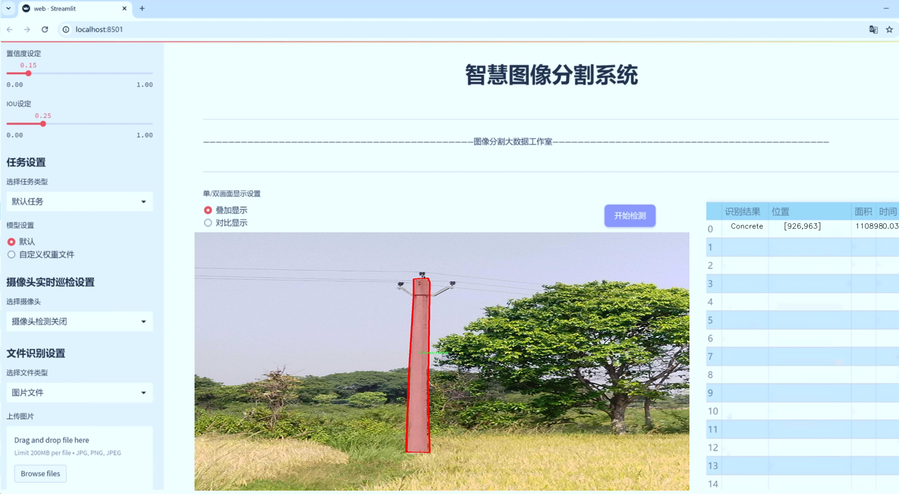
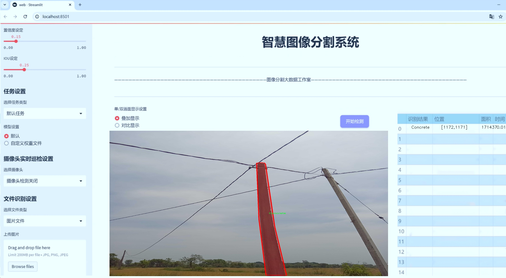
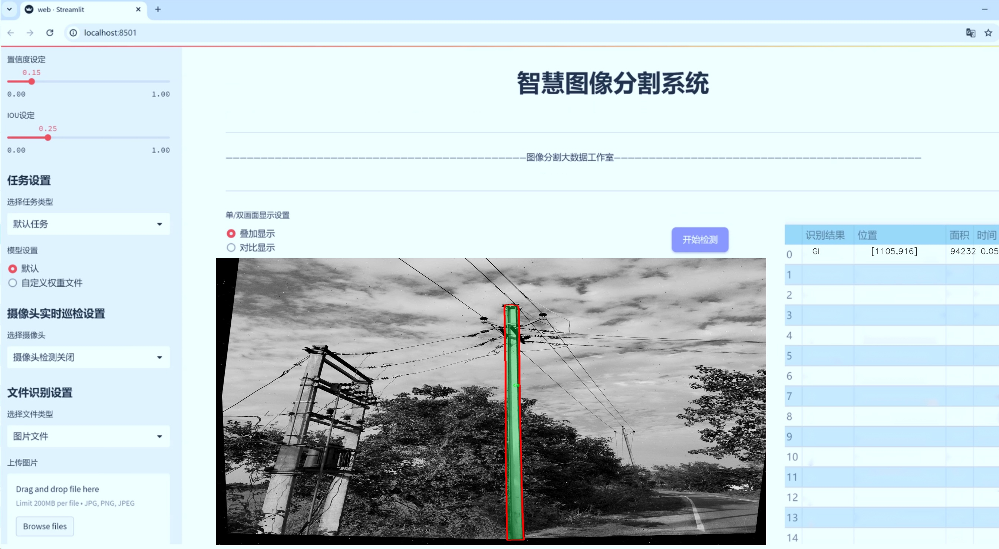
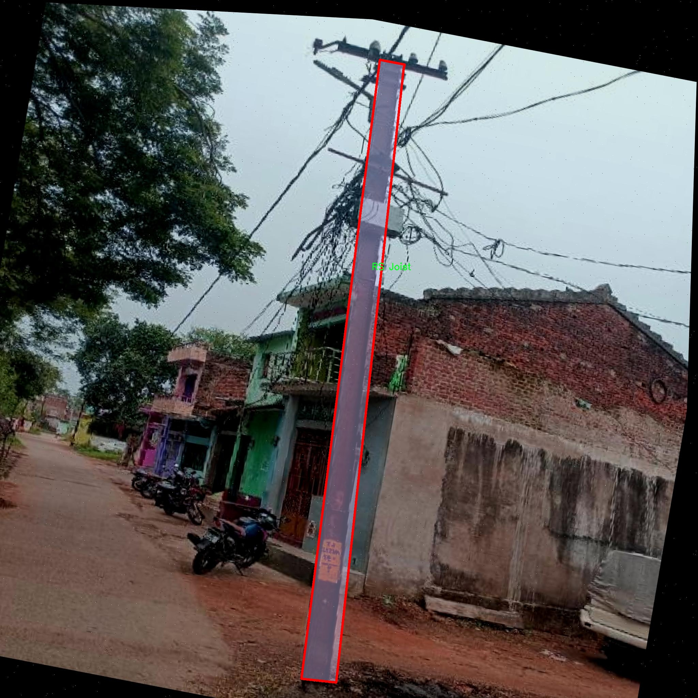
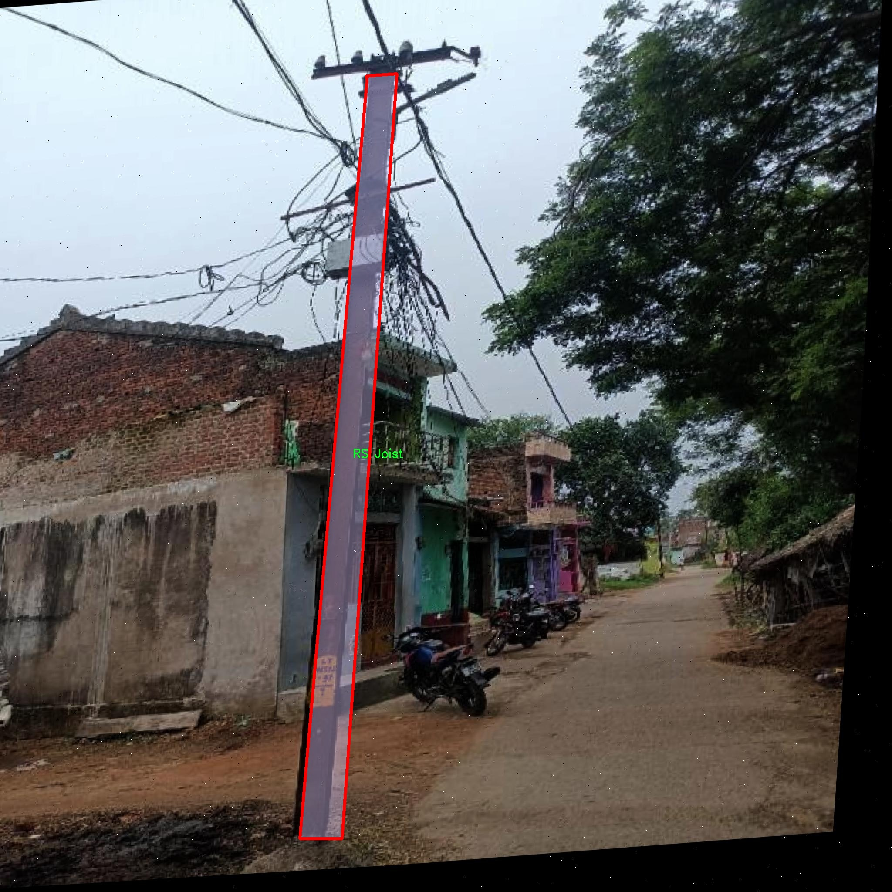
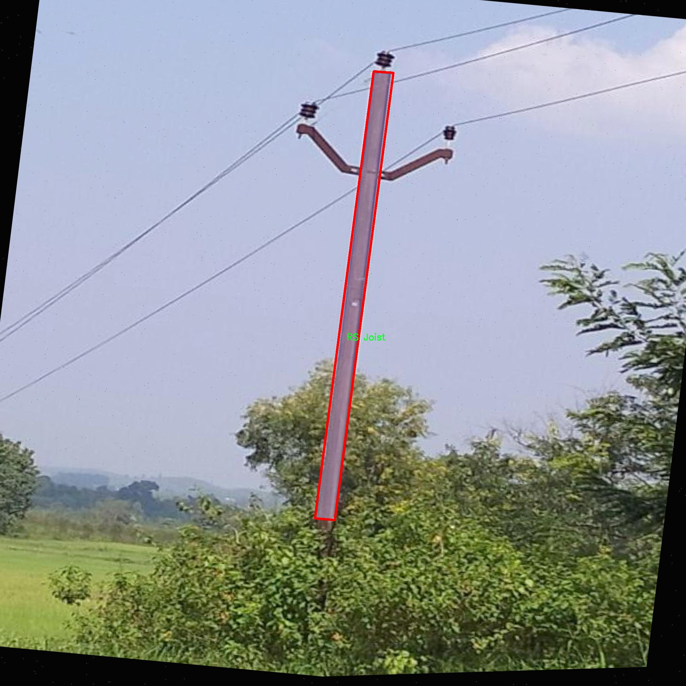
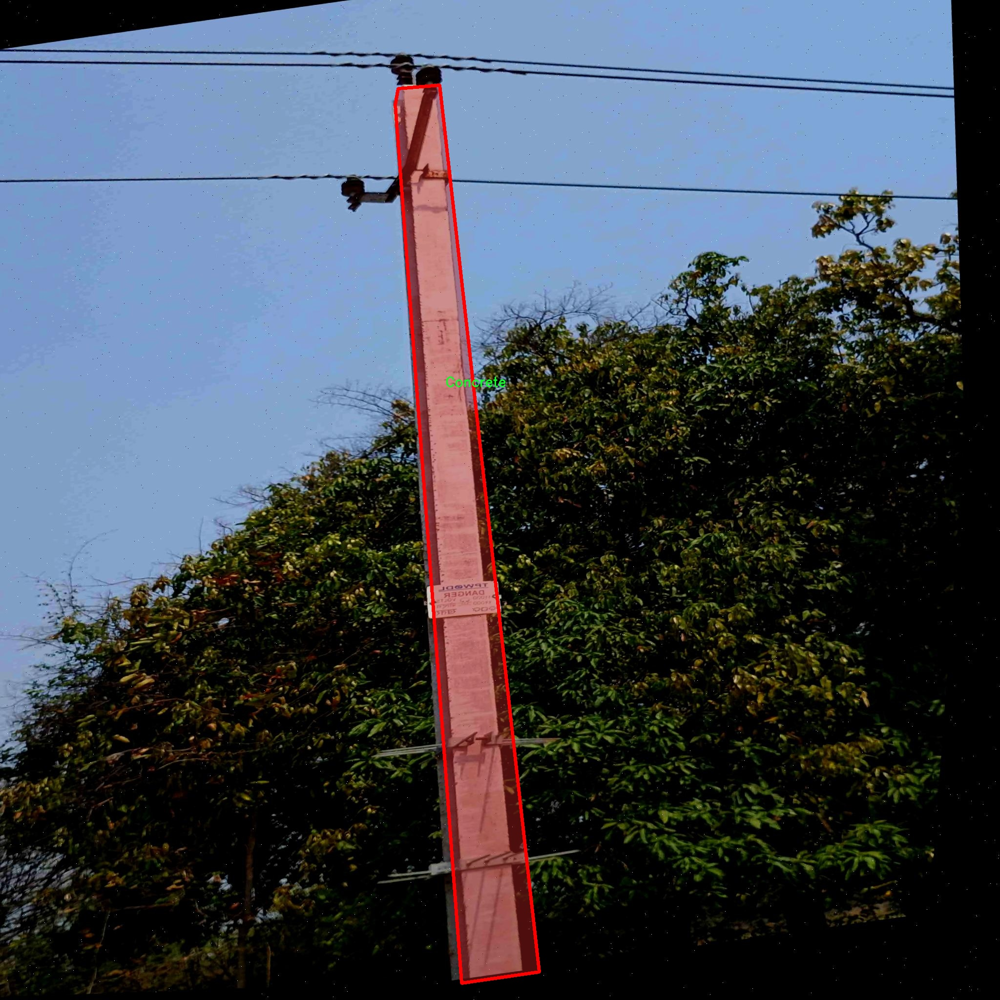
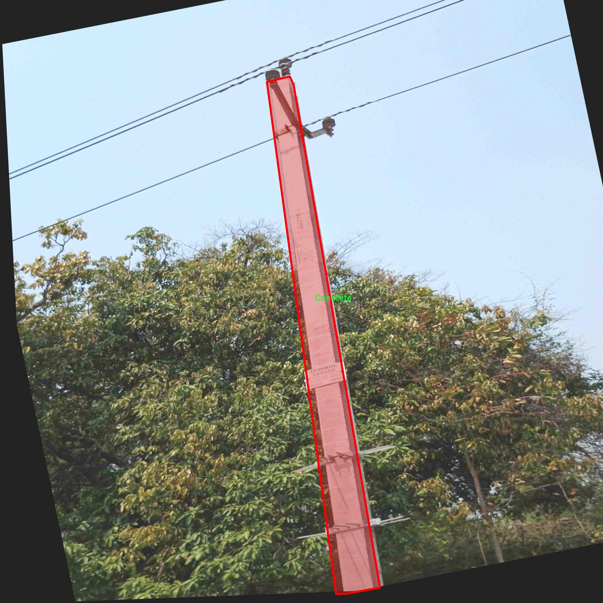

# 电线杆识别图像分割系统源码＆数据集分享
 [yolov8-seg-C2f-DLKA＆yolov8-seg-p2等50+全套改进创新点发刊_一键训练教程_Web前端展示]

### 1.研究背景与意义

项目参考[ILSVRC ImageNet Large Scale Visual Recognition Challenge](https://gitee.com/YOLOv8_YOLOv11_Segmentation_Studio/projects)

项目来源[AAAI Global Al lnnovation Contest](https://kdocs.cn/l/cszuIiCKVNis)

研究背景与意义

随着城市化进程的加快，电力基础设施的建设与维护显得尤为重要。电线杆作为电力传输和分配系统的关键组成部分，其准确识别与分类对于电力系统的管理、维护及故障排查具有重要意义。传统的电线杆识别方法多依赖人工巡检，效率低下且容易受到人为因素的影响。近年来，计算机视觉技术的迅猛发展为电线杆的自动识别与分类提供了新的解决方案，尤其是基于深度学习的图像分割技术在目标检测领域取得了显著成效。

YOLO（You Only Look Once）系列模型因其高效的实时检测能力而广泛应用于各种视觉任务。YOLOv8作为该系列的最新版本，进一步提升了检测精度和速度，成为电线杆识别的理想选择。然而，现有的YOLOv8模型在处理复杂场景中的电线杆识别时，仍面临一些挑战，如不同材质的电线杆在外观上的差异、背景复杂性对识别精度的影响等。因此，基于改进YOLOv8的电线杆识别图像分割系统的研究具有重要的理论和实践意义。

本研究将基于一个包含1300张图像的电线杆数据集，涵盖混凝土、GI（镀锌铁）、RS Joist（钢梁）、Rail（轨道）和Steel Tubular（钢管）等五种电线杆材质，进行深入的分析与实验。通过对这些不同材质的电线杆进行实例分割，不仅可以提高电线杆的识别精度，还能为后续的电力设施管理提供数据支持。数据集的多样性使得模型在训练过程中能够学习到丰富的特征，从而增强其在实际应用中的鲁棒性。

在技术层面，改进YOLOv8的图像分割系统将通过优化网络结构、调整损失函数和增强数据预处理等手段，提升模型对不同材质电线杆的识别能力。此外，采用实例分割技术，可以在像素级别上精确区分电线杆与背景，进而实现更为细致的分析。这一过程不仅有助于提高电线杆的检测率，还能有效降低误检率，提升电力设施的安全性和可靠性。

从社会意义上看，电力基础设施的智能化管理是现代城市发展的重要组成部分。通过建立高效的电线杆识别与分类系统，可以为电力公司提供实时监控与维护决策支持，降低人工成本，提高工作效率。同时，随着智能电网和物联网技术的发展，电线杆的智能识别将为电力系统的自动化、智能化提供基础数据，推动电力行业的数字化转型。

综上所述，基于改进YOLOv8的电线杆识别图像分割系统的研究，不仅具有重要的学术价值，也对实际应用具有深远的影响。通过这一研究，期望能够为电力基础设施的智能管理提供新的思路和方法，为城市的可持续发展贡献力量。

### 2.图片演示







##### 注意：由于此博客编辑较早，上面“2.图片演示”和“3.视频演示”展示的系统图片或者视频可能为老版本，新版本在老版本的基础上升级如下：（实际效果以升级的新版本为准）

  （1）适配了YOLOV8的“目标检测”模型和“实例分割”模型，通过加载相应的权重（.pt）文件即可自适应加载模型。

  （2）支持“图片识别”、“视频识别”、“摄像头实时识别”三种识别模式。

  （3）支持“图片识别”、“视频识别”、“摄像头实时识别”三种识别结果保存导出，解决手动导出（容易卡顿出现爆内存）存在的问题，识别完自动保存结果并导出到tempDir中。

  （4）支持Web前端系统中的标题、背景图等自定义修改，后面提供修改教程。

  另外本项目提供训练的数据集和训练教程,暂不提供权重文件（best.pt）,需要您按照教程进行训练后实现图片演示和Web前端界面演示的效果。

### 3.视频演示

[3.1 视频演示](https://www.bilibili.com/video/BV1NgyHYQESc/)

### 4.数据集信息展示

##### 4.1 本项目数据集详细数据（类别数＆类别名）

nc: 5
names: ['Concrete', 'GI', 'RS Joist', 'Rail', 'Steel Tubular']


##### 4.2 本项目数据集信息介绍

数据集信息展示

在电线杆识别图像分割系统的研究中，数据集的构建与选择至关重要。本研究所采用的数据集名为“Pole Material”，专门针对电线杆的不同材料进行分类与标注，旨在为改进YOLOv8-seg模型提供高质量的训练数据。该数据集共包含五个类别，分别为混凝土（Concrete）、镀锌铁（GI）、RS型钢（RS Joist）、轨道（Rail）和钢管（Steel Tubular）。这些类别的选择不仅反映了电线杆在实际应用中的多样性，也为模型的泛化能力提供了广泛的基础。

“Pole Material”数据集的构建过程经过精心设计，确保了数据的多样性和代表性。每个类别的样本均来源于不同的地理位置和环境条件，涵盖了城市、乡村以及工业区等多种场景。这种多样性使得模型在训练过程中能够学习到不同材料电线杆的特征，进而提高其在实际应用中的识别准确率。例如，混凝土电线杆通常具有较为粗壮的外形和灰色的表面，而钢管电线杆则表现出光滑的金属质感和较为细长的结构。通过对这些特征的学习，模型能够在不同的环境中有效区分各种材料的电线杆。

数据集中的每个类别均配备了丰富的标注信息，包括物体的边界框和分割掩码。这些标注不仅有助于模型在训练过程中进行精确的学习，还为后续的评估提供了可靠的依据。为了确保标注的准确性，数据集的构建团队采用了专业的标注工具，并进行了多轮的审核与校正。这一过程不仅提高了数据集的质量，也为研究人员提供了一个高标准的参考。

在数据集的规模方面，“Pole Material”数据集包含了数千张高分辨率的图像，涵盖了不同时间、不同光照条件下拍摄的电线杆。这种丰富的图像数据使得模型能够在训练过程中接触到多种变化，增强了其对环境变化的适应能力。此外，数据集还考虑到了不同季节和天气条件下的电线杆外观，进一步提高了模型的鲁棒性。

通过对“Pole Material”数据集的深入分析，我们可以发现其在电线杆识别与分割任务中的重要性。该数据集不仅为改进YOLOv8-seg模型提供了强有力的支持，也为后续的研究奠定了坚实的基础。随着电力基础设施的不断发展，电线杆的材料种类和外观特征也在不断演变，因此，持续更新和扩展数据集将是未来研究的重要方向。通过不断丰富数据集的内容，我们期望能够进一步提升模型的性能，使其在实际应用中更加高效、准确地完成电线杆的识别与分割任务。

总之，“Pole Material”数据集在电线杆识别图像分割系统的研究中发挥了不可或缺的作用，其丰富的类别、精确的标注和多样的样本为模型的训练与评估提供了坚实的基础。随着研究的深入，我们期待这一数据集能够为电力行业的智能化发展贡献更多的力量。











### 5.全套项目环境部署视频教程（零基础手把手教学）

[5.1 环境部署教程链接（零基础手把手教学）](https://www.bilibili.com/video/BV1jG4Ve4E9t/?vd_source=bc9aec86d164b67a7004b996143742dc)


[5.2 安装Python虚拟环境创建和依赖库安装视频教程链接（零基础手把手教学）](https://www.bilibili.com/video/BV1nA4VeYEze/?vd_source=bc9aec86d164b67a7004b996143742dc)

### 6.手把手YOLOV8-seg训练视频教程（零基础小白有手就能学会）

[6.1 手把手YOLOV8-seg训练视频教程（零基础小白有手就能学会）](https://www.bilibili.com/video/BV1cA4VeYETe/?vd_source=bc9aec86d164b67a7004b996143742dc)


按照上面的训练视频教程链接加载项目提供的数据集，运行train.py即可开始训练



     Epoch   gpu_mem       box       obj       cls    labels  img_size
     1/200     0G   0.01576   0.01955  0.007536        22      1280: 100%|██████████| 849/849 [14:42<00:00,  1.04s/it]
               Class     Images     Labels          P          R     mAP@.5 mAP@.5:.95: 100%|██████████| 213/213 [01:14<00:00,  2.87it/s]
                 all       3395      17314      0.994      0.957      0.0957      0.0843

     Epoch   gpu_mem       box       obj       cls    labels  img_size
     2/200     0G   0.01578   0.01923  0.007006        22      1280: 100%|██████████| 849/849 [14:44<00:00,  1.04s/it]
               Class     Images     Labels          P          R     mAP@.5 mAP@.5:.95: 100%|██████████| 213/213 [01:12<00:00,  2.95it/s]
                 all       3395      17314      0.996      0.956      0.0957      0.0845

     Epoch   gpu_mem       box       obj       cls    labels  img_size
     3/200     0G   0.01561    0.0191  0.006895        27      1280: 100%|██████████| 849/849 [10:56<00:00,  1.29it/s]
               Class     Images     Labels          P          R     mAP@.5 mAP@.5:.95: 100%|███████   | 187/213 [00:52<00:00,  4.04it/s]
                 all       3395      17314      0.996      0.957      0.0957      0.0845


### 7.50+种全套YOLOV8-seg创新点代码加载调参视频教程（一键加载写好的改进模型的配置文件）

[7.1 50+种全套YOLOV8-seg创新点代码加载调参视频教程（一键加载写好的改进模型的配置文件）](https://www.bilibili.com/video/BV1Hw4VePEXv/?vd_source=bc9aec86d164b67a7004b996143742dc)

### 8.YOLOV8-seg图像分割算法原理

原始YOLOv8-seg算法原理

YOLOv8-seg算法是YOLO系列中最新的版本，专注于目标检测与实例分割任务。它在YOLOv5的基础上进行了多项创新和改进，旨在提高模型的性能和适用性。YOLOv8-seg不仅延续了YOLO系列一贯的高效性和实时性，还通过新的网络结构和损失函数设计，进一步增强了对复杂场景的适应能力。

首先，YOLOv8-seg的网络结构分为三个主要部分：输入端、主干网络和检测头。输入端负责接收和预处理输入图像，主干网络则是特征提取的核心部分，而检测头则负责最终的目标分类和定位。YOLOv8-seg在主干网络中采用了新的C2f模块，取代了YOLOv5中的C3模块。C2f模块通过增加更多的残差连接，丰富了梯度信息的传递，使得网络在训练过程中能够更有效地学习到特征。这种设计不仅提升了模型的表现力，还在保持轻量化的同时，增强了对小目标的检测能力。

在特征融合方面，YOLOv8-seg依然采用了PAN-FPN结构，以实现多尺度特征的有效融合。该结构能够充分利用不同层次的特征信息，从而提高模型对各种尺寸目标的检测精度。通过对特征图的上下采样，YOLOv8-seg能够在不同尺度上进行信息的交互与融合，确保在复杂场景中仍能保持高效的检测性能。

YOLOv8-seg在检测头的设计上进行了显著的改进。传统的耦合头结构被解耦头结构所取代，这一变化使得分类和定位任务可以独立进行，从而提高了模型的灵活性和准确性。解耦头的设计允许模型在处理目标时，可以分别优化分类和回归的损失，进而提升整体的检测效果。此外，YOLOv8-seg采用了Anchor-Free的检测策略，去除了传统的Anchor-Based方法，这一转变使得模型在面对不同尺寸和形状的目标时，能够更加自适应，减少了对预定义锚框的依赖。

在训练过程中，YOLOv8-seg引入了动态标签分配策略，以提高正负样本的匹配效率。与以往的聚类候选框方法不同，YOLOv8-seg通过TOOD策略实现了对样本的动态分配。这一策略不仅考虑了目标的尺寸和分布特征，还能根据实时的训练情况调整标签的分配，从而提升模型的学习效率。YOLOv8-seg的损失函数设计也进行了创新，采用了Varifocal Loss作为分类损失，并结合CIoULoss与DFLLoss作为回归损失。这种组合方式使得模型在训练时能够更好地关注高质量的正样本，同时降低负样本对损失的影响，从而提高整体的检测精度。

在数据预处理方面，YOLOv8-seg延续了YOLOv5的增强策略，包括马赛克增强、混合增强、空间扰动和颜色扰动等。这些数据增强手段不仅丰富了训练样本的多样性，还提高了模型对不同场景的适应能力，使得YOLOv8-seg在实际应用中表现得更加稳健。

总的来说，YOLOv8-seg算法通过对网络结构、损失函数、标签分配策略等多个方面的创新，极大地提升了目标检测与实例分割的性能。其高效的特征提取能力、灵活的检测头设计以及动态的训练策略，使得YOLOv8-seg在计算机视觉领域中占据了重要的地位。随着技术的不断进步，YOLOv8-seg无疑将为各种实际应用提供更加可靠和高效的解决方案，推动目标检测与实例分割技术的进一步发展。


### 9.系统功能展示（检测对象为举例，实际内容以本项目数据集为准）

图9.1.系统支持检测结果表格显示

  图9.2.系统支持置信度和IOU阈值手动调节

  图9.3.系统支持自定义加载权重文件best.pt(需要你通过步骤5中训练获得)

  图9.4.系统支持摄像头实时识别

  图9.5.系统支持图片识别

  图9.6.系统支持视频识别

  图9.7.系统支持识别结果文件自动保存

  图9.8.系统支持Excel导出检测结果数据


### 10.50+种全套YOLOV8-seg创新点原理讲解（非科班也可以轻松写刊发刊，V11版本正在科研待更新）

#### 10.1 由于篇幅限制，每个创新点的具体原理讲解就不一一展开，具体见下列网址中的创新点对应子项目的技术原理博客网址【Blog】：


[10.1 50+种全套YOLOV8-seg创新点原理讲解链接](https://gitee.com/qunmasj/good)

#### 10.2 部分改进模块原理讲解(完整的改进原理见上图和技术博客链接)【如果此小节的图加载失败可以通过CSDN或者Github搜索该博客的标题访问原始博客，原始博客图片显示正常】
### YOLOv8简介
#### Yolov8网络模型
Yolov8n的网络分为输入端、主干网( Back-bone) 、Neck模块和输出端4个部分（图4)。输
人端主要有马赛克( Mosaic）数据增强、自适应锚框计算和自适应灰度填充。主干网有Conv、C2和SPPF结构，其中，C2r模块是对残差特征进行学习的主要模块，该模块仿照Yolov7的ELAN结构,通过更多的分支跨层连接，丰富了模型的梯度流，可形成一个具有更强特征表示能力的神经网络模
块。Neck模块采用PAN ( path aggregation nelwOrk ,结构，可加强网络对不同缩放尺度对象特征融合的
能力。输出端将分类和检测过程进行解耦，主要包括损失计算和目标检测框筛选，其中，损失计算过程主要包括正负样本分配策略和 Loss计算，Yolov8n 网络主要使用TaskAlignedAssignerl 10]方法，即根据分类与回归的分数加权结果选择正样本;Loss计算包括分类和回归2个分支，无Ob-jecIness分支。分类分支依然采用BCE Loss，回归分支则使用了Distribution Focal Loss!11〕和CIOU( complele inlersection over union)损失函数。

### 可扩张残差（DWR）注意力模块
当前的许多工作直接采用多速率深度扩张卷积从一个输入特征图中同时捕获多尺度上下文信息，从而提高实时语义分割的特征提取效率。 然而，这种设计可能会因为结构和超参数的不合理而导致多尺度上下文信息的访问困难。 为了降低绘制多尺度上下文信息的难度，我们提出了一种高效的多尺度特征提取方法，该方法分解了原始的单步特征提取方法方法分为两个步骤，区域残差-语义残差。 在该方法中，多速率深度扩张卷积在特征提取中发挥更简单的作用：根据第一步提供的每个简明区域形式特征图，在第二步中使用一个所需的感受野执行简单的基于语义的形态过滤 一步，提高他们的效率。 此外，扩张率和扩张卷积的容量每个网络阶段都经过精心设计，以充分利用所有可以实现的区域形式的特征图。 因此，我们分别为高层和低层网络设计了一种新颖的扩张式残差（DWR）模块和简单倒置残差（SIR）模块。


首先，该博客引入了一个Dilation-wise Residual（DWR）模块，用于提取网络高层的特征，如图2a所示。多分支结构用于扩展感受野，其中每个分支采用不同空洞率的空洞深度卷积。
然后，专门设计了一个Simple Inverted Residual（SIR）模块来提取网络低层的特征，如图2b所示。该模块仅具有3×3的微小感受野，但使用inverted bottleneck式结构来扩展通道数量，确保更强的特征提取能力。
最后，基于DWR和SIR模块，构建了一个编码器-解码器风格的网络DWRSeg，其中解码器采用了简单的类似FCN的结构。解码器使用来自最后两个阶段的强语义信息直接对特征图进行上采样，然后将它们与来自较低阶段的特征图（包含丰富的详细信息）拼接起来，以进行最终预测。


### 11.项目核心源码讲解（再也不用担心看不懂代码逻辑）

#### 11.1 ultralytics\models\yolo\classify\predict.py

以下是经过精简和注释的核心代码部分：

```python
# 导入必要的库
import torch
from ultralytics.engine.predictor import BasePredictor
from ultralytics.engine.results import Results
from ultralytics.utils import DEFAULT_CFG, ops

class ClassificationPredictor(BasePredictor):
    """
    ClassificationPredictor类用于基于分类模型进行预测。
    该类继承自BasePredictor类。
    """

    def __init__(self, cfg=DEFAULT_CFG, overrides=None, _callbacks=None):
        """初始化ClassificationPredictor，设置任务为'分类'。"""
        super().__init__(cfg, overrides, _callbacks)  # 调用父类构造函数
        self.args.task = 'classify'  # 设置任务类型为分类

    def preprocess(self, img):
        """将输入图像转换为模型兼容的数据类型。"""
        # 如果输入不是torch.Tensor类型，则进行转换
        if not isinstance(img, torch.Tensor):
            img = torch.stack([self.transforms(im) for im in img], dim=0)  # 应用预处理变换并堆叠
        # 将图像移动到模型所在的设备（CPU或GPU）
        img = (img if isinstance(img, torch.Tensor) else torch.from_numpy(img)).to(self.model.device)
        # 根据模型的精度要求，将图像转换为半精度（fp16）或单精度（fp32）
        return img.half() if self.model.fp16 else img.float()  # uint8转换为fp16/32

    def postprocess(self, preds, img, orig_imgs):
        """对预测结果进行后处理，返回Results对象。"""
        # 如果原始图像不是列表，则将其转换为numpy数组
        if not isinstance(orig_imgs, list):
            orig_imgs = ops.convert_torch2numpy_batch(orig_imgs)

        results = []  # 初始化结果列表
        for i, pred in enumerate(preds):  # 遍历每个预测结果
            orig_img = orig_imgs[i]  # 获取对应的原始图像
            img_path = self.batch[0][i]  # 获取图像路径
            # 创建Results对象并添加到结果列表
            results.append(Results(orig_img, path=img_path, names=self.model.names, probs=pred))
        return results  # 返回结果列表
```

### 代码分析
1. **导入库**：引入了必要的PyTorch库和Ultralytics库中的模块。
2. **ClassificationPredictor类**：这是一个用于分类任务的预测器类，继承自`BasePredictor`。
3. **初始化方法**：构造函数中调用父类的构造函数，并设置任务类型为分类。
4. **预处理方法**：将输入图像转换为模型可以接受的格式，包括类型转换和设备转移。
5. **后处理方法**：将模型的预测结果转换为可读的格式，返回包含原始图像、路径、类别名称和预测概率的结果对象列表。

这个文件是Ultralytics YOLO项目中的一个Python脚本，主要用于实现基于分类模型的预测功能。它定义了一个名为`ClassificationPredictor`的类，该类继承自`BasePredictor`，用于处理图像分类任务。

在文件开头，首先导入了必要的库，包括`torch`和一些来自Ultralytics引擎的模块。这些模块提供了基本的预测功能和结果处理功能。

`ClassificationPredictor`类的构造函数`__init__`初始化了预测器，并将任务类型设置为“分类”。在初始化过程中，它调用了父类`BasePredictor`的构造函数，并传入了配置参数、覆盖参数和回调函数。

`preprocess`方法用于对输入图像进行预处理，以便将其转换为模型可以接受的数据格式。该方法首先检查输入是否为`torch.Tensor`类型，如果不是，则将输入图像列表转换为张量。接着，将图像移动到模型所在的设备上（如GPU），并根据模型的精度要求将数据类型转换为半精度（fp16）或单精度（fp32）。

`postprocess`方法负责对模型的预测结果进行后处理，返回一个`Results`对象的列表。该方法首先检查原始图像是否为列表，如果不是，则将其转换为NumPy数组。然后，对于每个预测结果，它将原始图像、图像路径以及模型的名称和预测概率封装到`Results`对象中，并将这些对象添加到结果列表中。

总的来说，这个文件实现了一个分类预测器，能够处理图像输入，进行预处理和后处理，并返回分类结果。它的设计使得用户可以方便地使用不同的分类模型进行预测，并且支持Torchvision中的一些常见模型。

#### 11.2 ultralytics\utils\dist.py

以下是代码中最核心的部分，并附上详细的中文注释：

```python
import os
import re
import shutil
import socket
import sys
import tempfile
from pathlib import Path

def find_free_network_port() -> int:
    """
    查找本地主机上可用的网络端口。

    在单节点训练时，如果不想连接到真实的主节点，但需要设置
    `MASTER_PORT` 环境变量时，这个函数非常有用。
    """
    with socket.socket(socket.AF_INET, socket.SOCK_STREAM) as s:
        s.bind(('127.0.0.1', 0))  # 绑定到本地地址和随机端口
        return s.getsockname()[1]  # 返回分配的端口号


def generate_ddp_file(trainer):
    """生成 DDP 文件并返回其文件名。"""
    # 获取训练器的模块和类名
    module, name = f'{trainer.__class__.__module__}.{trainer.__class__.__name__}'.rsplit('.', 1)

    # 创建 DDP 文件的内容
    content = f'''overrides = {vars(trainer.args)} \nif __name__ == "__main__":
    from {module} import {name}
    from ultralytics.utils import DEFAULT_CFG_DICT

    cfg = DEFAULT_CFG_DICT.copy()
    cfg.update(save_dir='')   # 处理额外的键 'save_dir'
    trainer = {name}(cfg=cfg, overrides=overrides)
    trainer.train()'''
    
    # 创建 DDP 目录（如果不存在）
    (USER_CONFIG_DIR / 'DDP').mkdir(exist_ok=True)
    
    # 创建临时文件并写入内容
    with tempfile.NamedTemporaryFile(prefix='_temp_',
                                     suffix=f'{id(trainer)}.py',
                                     mode='w+',
                                     encoding='utf-8',
                                     dir=USER_CONFIG_DIR / 'DDP',
                                     delete=False) as file:
        file.write(content)  # 写入内容到临时文件
    return file.name  # 返回临时文件的名称


def generate_ddp_command(world_size, trainer):
    """生成并返回用于分布式训练的命令。"""
    import __main__  # 本地导入以避免特定问题
    if not trainer.resume:
        shutil.rmtree(trainer.save_dir)  # 如果不恢复训练，删除保存目录
    
    file = str(Path(sys.argv[0]).resolve())  # 获取当前脚本的绝对路径
    safe_pattern = re.compile(r'^[a-zA-Z0-9_. /\\-]{1,128}$')  # 允许的字符和最大长度限制
    # 检查文件名是否安全且存在，且以 .py 结尾
    if not (safe_pattern.match(file) and Path(file).exists() and file.endswith('.py')):
        file = generate_ddp_file(trainer)  # 生成 DDP 文件
    
    dist_cmd = 'torch.distributed.run' if TORCH_1_9 else 'torch.distributed.launch'  # 根据 PyTorch 版本选择命令
    port = find_free_network_port()  # 查找可用的网络端口
    # 构建命令列表
    cmd = [sys.executable, '-m', dist_cmd, '--nproc_per_node', f'{world_size}', '--master_port', f'{port}', file]
    return cmd, file  # 返回命令和文件名


def ddp_cleanup(trainer, file):
    """如果创建了临时文件，则删除它。"""
    if f'{id(trainer)}.py' in file:  # 检查文件名中是否包含临时文件的后缀
        os.remove(file)  # 删除临时文件
```

### 代码说明：
1. **查找可用端口**：`find_free_network_port` 函数用于查找本地可用的网络端口，适用于需要设置 `MASTER_PORT` 环境变量的场景。
2. **生成 DDP 文件**：`generate_ddp_file` 函数创建一个用于分布式数据并行（DDP）训练的 Python 文件，并将训练器的参数写入该文件。
3. **生成分布式训练命令**：`generate_ddp_command` 函数根据训练器的状态和世界大小生成用于启动分布式训练的命令。
4. **清理临时文件**：`ddp_cleanup` 函数用于删除在训练过程中生成的临时文件，以保持文件系统的整洁。

这个程序文件是一个用于分布式训练的工具模块，主要涉及到在Ultralytics YOLO框架中处理分布式数据并行（DDP）训练的相关功能。文件中包含了一些函数，帮助用户在单节点或多节点环境中进行模型训练。

首先，文件导入了一些必要的库，包括操作系统、正则表达式、文件处理、网络套接字、系统参数、临时文件和路径处理等。这些库为后续的功能实现提供了基础支持。

`find_free_network_port` 函数用于查找本地主机上一个可用的网络端口。这在单节点训练时非常有用，因为我们可能不想连接到真实的主节点，但仍需设置 `MASTER_PORT` 环境变量。该函数通过创建一个TCP套接字并绑定到本地地址的随机端口来实现这一点。

`generate_ddp_file` 函数用于生成一个DDP（分布式数据并行）文件，并返回其文件名。它根据传入的训练器对象，提取其类的模块和名称，并构建一个包含训练逻辑的Python脚本内容。然后，它在用户配置目录下创建一个名为 'DDP' 的文件夹（如果不存在的话），并将生成的内容写入一个临时文件中。这个临时文件的命名包含训练器的唯一ID，以避免命名冲突。

`generate_ddp_command` 函数生成并返回用于分布式训练的命令。它首先检查训练器是否需要恢复训练，如果不需要，则删除保存目录。接着，它获取当前脚本的路径，并使用正则表达式验证该路径是否安全。如果路径不符合要求，则调用 `generate_ddp_file` 生成一个新的DDP文件。然后，根据PyTorch的版本选择合适的分布式命令（`torch.distributed.run` 或 `torch.distributed.launch`），并调用 `find_free_network_port` 查找一个可用的端口。最终，构建出一个包含Python可执行文件、分布式命令、进程数和端口的命令列表。

最后，`ddp_cleanup` 函数用于在训练结束后清理临时文件。如果临时文件的后缀与训练器的ID匹配，则删除该文件。这有助于保持文件系统的整洁，避免不必要的临时文件占用空间。

总体来说，这个模块提供了一些实用的工具函数，帮助用户在Ultralytics YOLO框架中高效地进行分布式训练。

#### 11.3 ui.py

以下是保留的核心代码部分，并添加了详细的中文注释：

```python
import sys
import subprocess

def run_script(script_path):
    """
    使用当前 Python 环境运行指定的脚本。

    Args:
        script_path (str): 要运行的脚本路径

    Returns:
        None
    """
    # 获取当前 Python 解释器的路径
    python_path = sys.executable

    # 构建运行命令，使用 streamlit 运行指定的脚本
    command = f'"{python_path}" -m streamlit run "{script_path}"'

    # 执行命令，并等待其完成
    result = subprocess.run(command, shell=True)
    
    # 检查命令执行的返回码，如果不为0，表示出错
    if result.returncode != 0:
        print("脚本运行出错。")

# 实例化并运行应用
if __name__ == "__main__":
    # 指定要运行的脚本路径
    script_path = "web.py"  # 这里可以替换为实际的脚本路径

    # 调用函数运行脚本
    run_script(script_path)
```

### 代码说明：
1. **导入模块**：
   - `sys`：用于获取当前 Python 解释器的路径。
   - `subprocess`：用于执行外部命令。

2. **定义 `run_script` 函数**：
   - 该函数接收一个脚本路径作为参数，并使用当前 Python 环境运行该脚本。
   - 通过 `sys.executable` 获取当前 Python 解释器的路径。
   - 构建一个命令字符串，使用 `streamlit` 模块运行指定的脚本。
   - 使用 `subprocess.run` 执行命令，并检查返回码以判断脚本是否成功运行。

3. **主程序入口**：
   - 在 `if __name__ == "__main__":` 块中，指定要运行的脚本路径（此处为 `web.py`）。
   - 调用 `run_script` 函数来执行指定的脚本。

这个程序文件名为 `ui.py`，其主要功能是通过当前的 Python 环境运行一个指定的脚本。代码的结构相对简单，主要由几个部分组成。

首先，程序导入了必要的模块，包括 `sys`、`os` 和 `subprocess`。其中，`sys` 模块用于访问与 Python 解释器相关的变量和函数，`os` 模块提供了与操作系统交互的功能，而 `subprocess` 模块则用于创建新进程、连接到它们的输入/输出/错误管道，并获取它们的返回码。

接下来，程序从 `QtFusion.path` 模块中导入了 `abs_path` 函数，这个函数的作用是获取文件的绝对路径。

在 `run_script` 函数中，程序接收一个参数 `script_path`，表示要运行的脚本的路径。函数首先获取当前 Python 解释器的路径，并将其存储在 `python_path` 变量中。然后，程序构建一个命令字符串，使用 `streamlit` 模块来运行指定的脚本。这个命令使用了 Python 的 `-m` 选项来指定模块运行。

随后，程序通过 `subprocess.run` 方法执行构建好的命令。该方法的 `shell=True` 参数允许在 shell 中执行命令。执行完命令后，程序检查返回码，如果返回码不为零，表示脚本运行出错，程序将输出一条错误信息。

最后，在 `if __name__ == "__main__":` 这一块，程序首先调用 `abs_path` 函数来获取 `web.py` 脚本的绝对路径，并将其赋值给 `script_path` 变量。然后，程序调用 `run_script` 函数，传入 `script_path`，以运行指定的脚本。

整体来看，这个程序的功能是封装了一个简单的接口，用于在当前 Python 环境中运行一个名为 `web.py` 的脚本，并处理可能出现的错误。

#### 11.4 ultralytics\nn\extra_modules\ops_dcnv3\setup.py

以下是经过简化和注释的核心代码部分：

```python
# 导入必要的库
import os
import glob
import torch
from torch.utils.cpp_extension import CUDA_HOME, CppExtension, CUDAExtension
from setuptools import find_packages, setup

# 定义依赖包
requirements = ["torch", "torchvision"]

def get_extensions():
    # 获取当前文件目录
    this_dir = os.path.dirname(os.path.abspath(__file__))
    # 定义扩展模块的源代码目录
    extensions_dir = os.path.join(this_dir, "src")

    # 查找主文件和CPU、CUDA源文件
    main_file = glob.glob(os.path.join(extensions_dir, "*.cpp"))
    source_cpu = glob.glob(os.path.join(extensions_dir, "cpu", "*.cpp"))
    source_cuda = glob.glob(os.path.join(extensions_dir, "cuda", "*.cu"))

    # 将主文件和CPU源文件合并
    sources = main_file + source_cpu
    extension = CppExtension  # 默认使用 CppExtension
    extra_compile_args = {"cxx": []}  # 编译参数
    define_macros = []  # 宏定义

    # 检查CUDA是否可用
    if torch.cuda.is_available() and CUDA_HOME is not None:
        extension = CUDAExtension  # 使用CUDA扩展
        sources += source_cuda  # 添加CUDA源文件
        define_macros += [("WITH_CUDA", None)]  # 定义WITH_CUDA宏
        extra_compile_args["nvcc"] = []  # 可以添加CUDA编译参数
    else:
        raise NotImplementedError('Cuda is not available')  # 抛出异常

    # 生成完整的源文件路径
    sources = [os.path.join(extensions_dir, s) for s in sources]
    include_dirs = [extensions_dir]  # 包含目录

    # 创建扩展模块
    ext_modules = [
        extension(
            "DCNv3",  # 模块名称
            sources,  # 源文件列表
            include_dirs=include_dirs,  # 包含目录
            define_macros=define_macros,  # 宏定义
            extra_compile_args=extra_compile_args,  # 编译参数
        )
    ]
    return ext_modules  # 返回扩展模块列表

# 设置包信息和扩展模块
setup(
    name="DCNv3",  # 包名称
    version="1.1",  # 版本号
    author="InternImage",  # 作者
    url="https://github.com/OpenGVLab/InternImage",  # 项目网址
    description="PyTorch Wrapper for CUDA Functions of DCNv3",  # 描述
    packages=find_packages(exclude=("configs", "tests")),  # 查找包
    ext_modules=get_extensions(),  # 获取扩展模块
    cmdclass={"build_ext": torch.utils.cpp_extension.BuildExtension},  # 自定义构建命令
)
```

### 代码说明：
1. **导入库**：导入了必要的库，包括文件操作、PyTorch扩展工具和setuptools。
2. **获取扩展函数**：定义了一个函数`get_extensions()`，用于查找和配置C++/CUDA扩展模块。
3. **源文件查找**：使用`glob`模块查找源文件，分为主文件、CPU和CUDA文件。
4. **CUDA支持检查**：检查CUDA是否可用，如果可用则配置CUDA扩展，否则抛出异常。
5. **扩展模块创建**：创建扩展模块的配置，包括模块名称、源文件、包含目录、宏定义和编译参数。
6. **包设置**：使用`setup()`函数配置包的基本信息和扩展模块，准备安装。

这个 `setup.py` 文件是用于构建和安装一个名为 `DCNv3` 的 Python 包，该包是一个用于 PyTorch 的 CUDA 函数的封装。文件开头包含了一些版权信息和许可证声明，表明该代码是由 OpenGVLab 开发并遵循 MIT 许可证。

首先，文件导入了一些必要的模块，包括 `os` 和 `glob` 用于文件路径处理，`torch` 用于深度学习相关的操作，以及 `torch.utils.cpp_extension` 中的 `CUDA_HOME`、`CppExtension` 和 `CUDAExtension` 用于编译 C++ 和 CUDA 扩展。还导入了 `setuptools` 中的 `find_packages` 和 `setup` 用于打包和安装。

接下来，定义了一个 `requirements` 列表，列出了该包所依赖的库，包括 `torch` 和 `torchvision`。

`get_extensions` 函数用于获取要编译的扩展模块。首先，它获取当前文件所在目录的路径，并构建出扩展源代码的目录路径。然后，通过 `glob` 模块查找所有的 C++ 源文件（`.cpp`）和 CUDA 源文件（`.cu`），分别存储在 `main_file`、`source_cpu` 和 `source_cuda` 列表中。

接着，默认情况下，扩展类型被设置为 `CppExtension`，并初始化了一些编译参数和宏定义。如果检测到 CUDA 可用且 `CUDA_HOME` 不为空，则将扩展类型更改为 `CUDAExtension`，并将 CUDA 源文件添加到源列表中，同时定义了一个宏 `WITH_CUDA`。如果 CUDA 不可用，则抛出一个 `NotImplementedError`。

所有的源文件路径被整理成绝对路径，并设置了包含目录。最后，创建了一个扩展模块列表 `ext_modules`，其中包含了 `DCNv3` 扩展的相关信息。

在文件的最后，调用 `setup` 函数来配置包的基本信息，包括包名、版本、作者、项目网址、描述、需要排除的包、扩展模块以及构建扩展的命令类。

总体来说，这个 `setup.py` 文件的主要功能是配置和构建一个 PyTorch 的 CUDA 扩展，方便用户在其项目中使用 DCNv3 的功能。

#### 11.5 train.py

以下是代码中最核心的部分，并附上详细的中文注释：

```python
import os
import torch
import yaml
from ultralytics import YOLO  # 导入YOLO模型库

if __name__ == '__main__':  # 确保该模块被直接运行时才执行以下代码
    # 设置训练参数
    workers = 1  # 数据加载的工作进程数量
    batch = 8  # 每个批次的样本数量，视显存和内存情况调整
    device = "0" if torch.cuda.is_available() else "cpu"  # 检查是否有可用的GPU

    # 获取数据集配置文件的绝对路径
    data_path = abs_path(f'datasets/data/data.yaml', path_type='current')

    # 将路径转换为Unix风格（使用'/'作为分隔符）
    unix_style_path = data_path.replace(os.sep, '/')
    # 获取数据集目录路径
    directory_path = os.path.dirname(unix_style_path)

    # 读取YAML文件，保持原有顺序
    with open(data_path, 'r') as file:
        data = yaml.load(file, Loader=yaml.FullLoader)

    # 修改数据集中训练、验证和测试的路径
    if 'train' in data and 'val' in data and 'test' in data:
        data['train'] = directory_path + '/train'  # 设置训练数据路径
        data['val'] = directory_path + '/val'      # 设置验证数据路径
        data['test'] = directory_path + '/test'    # 设置测试数据路径

        # 将修改后的数据写回YAML文件
        with open(data_path, 'w') as file:
            yaml.safe_dump(data, file, sort_keys=False)

    # 加载YOLO模型配置文件并加载预训练权重
    model = YOLO(r"C:\codeseg\codenew\50+种YOLOv8算法改进源码大全和调试加载训练教程（非必要）\改进YOLOv8模型配置文件\yolov8-seg-C2f-Faster.yaml").load("./weights/yolov8s-seg.pt")

    # 开始训练模型
    results = model.train(
        data=data_path,  # 指定训练数据的配置文件路径
        device=device,  # 指定训练所用的设备（GPU或CPU）
        workers=workers,  # 指定用于数据加载的工作进程数量
        imgsz=640,  # 指定输入图像的大小为640x640
        epochs=100,  # 指定训练的轮数为100
        batch=batch,  # 指定每个批次的样本数量
    )
```

### 代码核心部分解释：
1. **导入必要的库**：引入了处理文件路径、深度学习框架、YAML文件解析和YOLO模型的库。
2. **设置训练参数**：定义了工作进程数量、批次大小和设备类型（GPU或CPU）。
3. **读取和修改YAML配置文件**：读取数据集的配置文件，修改其中的训练、验证和测试数据路径，并将修改后的内容写回文件。
4. **加载YOLO模型**：根据指定的配置文件和预训练权重加载YOLO模型。
5. **开始训练模型**：调用模型的训练方法，传入必要的参数，如数据路径、设备、工作进程数量、图像大小、训练轮数和批次大小。

该程序文件`train.py`主要用于训练YOLO（You Only Look Once）模型，具体是YOLOv8的一个变种，适用于图像分割任务。程序的执行流程如下：

首先，程序导入了必要的库，包括`os`、`torch`、`yaml`、`ultralytics`中的YOLO模型，以及`matplotlib`用于图形显示。通过`matplotlib.use('TkAgg')`设置图形后端为TkAgg，以便在需要时显示图形界面。

在`if __name__ == '__main__':`块中，程序确保只有在直接运行该脚本时才会执行以下代码。首先，设置了一些训练参数，包括工作进程数`workers`为1，批次大小`batch`为8。接着，程序检查是否有可用的GPU，如果有，则将设备设置为"0"（表示第一个GPU），否则使用CPU。

接下来，程序通过`abs_path`函数获取数据集配置文件`data.yaml`的绝对路径，并将路径中的分隔符统一为Unix风格的斜杠。然后，使用`os.path.dirname`获取数据集的目录路径。

程序打开`data.yaml`文件并读取其内容，使用`yaml.load`方法保持原有顺序。随后，程序检查YAML文件中是否包含'train'、'val'和'test'三个字段，如果存在，则将这些字段的路径修改为相应的训练、验证和测试数据集的绝对路径。修改完成后，程序将更新后的数据写回到YAML文件中，确保数据路径的正确性。

在模型加载部分，程序通过`YOLO`类加载指定的YOLOv8模型配置文件和预训练权重。这里的模型配置文件路径和权重文件路径是硬编码的，用户可以根据需要进行修改。

最后，程序调用`model.train`方法开始训练模型，传入训练数据的配置文件路径、设备、工作进程数、输入图像大小（640x640）、训练的epoch数（100）以及批次大小。通过这些参数，模型将开始在指定的数据集上进行训练。

总体而言，该程序是一个用于训练YOLOv8模型的完整脚本，涵盖了数据准备、模型加载和训练过程的各个环节。

#### 11.6 ultralytics\trackers\utils\matching.py

以下是经过简化和注释的核心代码部分：

```python
import numpy as np
import scipy
from scipy.spatial.distance import cdist
from ultralytics.utils.metrics import bbox_ioa

try:
    import lap  # 导入线性分配库
    assert lap.__version__  # 确保导入的包是有效的
except (ImportError, AssertionError, AttributeError):
    from ultralytics.utils.checks import check_requirements
    check_requirements('lapx>=0.5.2')  # 检查并安装lapx库
    import lap

def linear_assignment(cost_matrix, thresh, use_lap=True):
    """
    使用线性分配算法进行匹配。

    参数:
        cost_matrix (np.ndarray): 成本矩阵，包含分配的成本值。
        thresh (float): 有效分配的阈值。
        use_lap (bool, optional): 是否使用lap.lapjv。默认为True。

    返回:
        (tuple): 包含匹配索引、未匹配的索引a和未匹配的索引b的元组。
    """
    if cost_matrix.size == 0:
        # 如果成本矩阵为空，返回空匹配和所有未匹配索引
        return np.empty((0, 2), dtype=int), tuple(range(cost_matrix.shape[0])), tuple(range(cost_matrix.shape[1]))

    if use_lap:
        # 使用lap库进行线性分配
        _, x, y = lap.lapjv(cost_matrix, extend_cost=True, cost_limit=thresh)
        matches = [[ix, mx] for ix, mx in enumerate(x) if mx >= 0]  # 找到匹配
        unmatched_a = np.where(x < 0)[0]  # 找到未匹配的a索引
        unmatched_b = np.where(y < 0)[0]  # 找到未匹配的b索引
    else:
        # 使用scipy进行线性分配
        x, y = scipy.optimize.linear_sum_assignment(cost_matrix)  # 行x，列y
        matches = np.asarray([[x[i], y[i]] for i in range(len(x)) if cost_matrix[x[i], y[i]] <= thresh])
        if len(matches) == 0:
            unmatched_a = list(np.arange(cost_matrix.shape[0]))
            unmatched_b = list(np.arange(cost_matrix.shape[1]))
        else:
            unmatched_a = list(set(np.arange(cost_matrix.shape[0])) - set(matches[:, 0]))
            unmatched_b = list(set(np.arange(cost_matrix.shape[1])) - set(matches[:, 1]))

    return matches, unmatched_a, unmatched_b  # 返回匹配和未匹配索引

def iou_distance(atracks, btracks):
    """
    基于交并比（IoU）计算轨迹之间的成本。

    参数:
        atracks (list[STrack] | list[np.ndarray]): 轨迹'a'或边界框的列表。
        btracks (list[STrack] | list[np.ndarray]): 轨迹'b'或边界框的列表。

    返回:
        (np.ndarray): 基于IoU计算的成本矩阵。
    """
    # 确定输入格式
    if (len(atracks) > 0 and isinstance(atracks[0], np.ndarray)) \
            or (len(btracks) > 0 and isinstance(btracks[0], np.ndarray)):
        atlbrs = atracks
        btlbrs = btracks
    else:
        atlbrs = [track.tlbr for track in atracks]  # 获取轨迹的边界框
        btlbrs = [track.tlbr for track in btracks]

    ious = np.zeros((len(atlbrs), len(btlbrs)), dtype=np.float32)  # 初始化IoU矩阵
    if len(atlbrs) and len(btlbrs):
        # 计算IoU
        ious = bbox_ioa(np.ascontiguousarray(atlbrs, dtype=np.float32),
                        np.ascontiguousarray(btlbrs, dtype=np.float32),
                        iou=True)
    return 1 - ious  # 返回成本矩阵（1 - IoU）

def embedding_distance(tracks, detections, metric='cosine'):
    """
    基于嵌入计算轨迹和检测之间的距离。

    参数:
        tracks (list[STrack]): 轨迹列表。
        detections (list[BaseTrack]): 检测列表。
        metric (str, optional): 距离计算的度量。默认为'cosine'。

    返回:
        (np.ndarray): 基于嵌入计算的成本矩阵。
    """
    cost_matrix = np.zeros((len(tracks), len(detections)), dtype=np.float32)  # 初始化成本矩阵
    if cost_matrix.size == 0:
        return cost_matrix
    det_features = np.asarray([track.curr_feat for track in detections], dtype=np.float32)  # 获取检测特征
    track_features = np.asarray([track.smooth_feat for track in tracks], dtype=np.float32)  # 获取轨迹特征
    cost_matrix = np.maximum(0.0, cdist(track_features, det_features, metric))  # 计算距离并确保非负
    return cost_matrix  # 返回成本矩阵

def fuse_score(cost_matrix, detections):
    """
    将成本矩阵与检测分数融合以生成单一相似度矩阵。

    参数:
        cost_matrix (np.ndarray): 包含分配成本值的矩阵。
        detections (list[BaseTrack]): 带有分数的检测列表。

    返回:
        (np.ndarray): 融合后的相似度矩阵。
    """
    if cost_matrix.size == 0:
        return cost_matrix
    iou_sim = 1 - cost_matrix  # 将成本矩阵转换为相似度
    det_scores = np.array([det.score for det in detections])  # 获取检测分数
    det_scores = np.expand_dims(det_scores, axis=0).repeat(cost_matrix.shape[0], axis=0)  # 扩展分数以匹配成本矩阵
    fuse_sim = iou_sim * det_scores  # 融合相似度
    return 1 - fuse_sim  # 返回融合后的成本
```

### 代码说明：
1. **linear_assignment**：实现线性分配算法，返回匹配的索引和未匹配的索引。
2. **iou_distance**：计算两个轨迹或边界框之间的交并比（IoU），返回成本矩阵。
3. **embedding_distance**：计算轨迹和检测之间的距离，基于特征嵌入，返回成本矩阵。
4. **fuse_score**：将成本矩阵与检测分数融合，生成相似度矩阵。

这个程序文件 `ultralytics/trackers/utils/matching.py` 是用于目标跟踪中的匹配算法实现，主要功能是通过计算不同目标之间的成本矩阵，来确定目标之间的最佳匹配关系。文件中包含了多个函数，每个函数负责不同的计算任务。

首先，文件导入了必要的库，包括 `numpy` 和 `scipy`，以及用于计算距离的 `cdist` 函数。还尝试导入 `lap` 库，这是一个用于线性分配的库，如果导入失败，则会检查并安装所需的依赖。

`linear_assignment` 函数是该文件的核心函数之一，负责执行线性分配。它接受一个成本矩阵和一个阈值，返回匹配的索引以及未匹配的索引。函数首先检查成本矩阵是否为空，如果为空，则返回空的匹配结果和所有未匹配的索引。如果选择使用 `lap` 库，则调用 `lapjv` 函数进行匹配；否则，使用 `scipy` 的 `linear_sum_assignment` 函数。最终，函数返回匹配结果和未匹配的索引。

`iou_distance` 函数计算基于交并比（IoU）的成本矩阵。它接受两个目标轨迹或边界框的列表，计算它们之间的IoU值，并返回一个成本矩阵。成本矩阵的值是1减去IoU值，这样更高的IoU值对应于更低的成本。

`embedding_distance` 函数则是基于特征嵌入计算轨迹和检测之间的距离。它接受轨迹和检测的列表，并计算它们之间的距离矩阵。这里使用了 `cdist` 函数来计算轨迹特征和检测特征之间的距离，支持多种距离度量（默认为余弦距离）。

最后，`fuse_score` 函数将成本矩阵与检测分数融合，生成一个相似度矩阵。它首先计算IoU相似度，然后将检测分数扩展到与成本矩阵相同的形状，最后通过相乘得到融合后的相似度矩阵。

总体而言，这个文件实现了目标跟踪中重要的匹配算法，通过不同的距离计算方法和融合策略，帮助提升目标跟踪的准确性和效率。

### 12.系统整体结构（节选）

### 整体功能和构架概括

Ultralytics项目是一个基于YOLO（You Only Look Once）模型的计算机视觉框架，主要用于目标检测、分类、分割和姿态估计等任务。该项目提供了一系列模块和工具，支持模型的训练、推理、评估和跟踪等功能。项目的结构包括模型定义、训练脚本、实用工具、用户界面以及各种扩展模块，形成了一个完整的深度学习解决方案。

以下是各个文件的功能概述整理成的Markdown表格：

| 文件路径                                               | 功能描述                                                                                      |
|------------------------------------------------------|-----------------------------------------------------------------------------------------------|
| `ultralytics/models/yolo/classify/predict.py`       | 实现图像分类模型的预测功能，包括输入图像的预处理和预测结果的后处理。                          |
| `ultralytics/utils/dist.py`                          | 提供分布式训练的工具函数，包括查找可用网络端口、生成DDP文件和命令、清理临时文件等。          |
| `ui.py`                                              | 运行指定的Python脚本（如`web.py`），封装了一个简单的接口用于启动Web界面。                    |
| `ultralytics/nn/extra_modules/ops_dcnv3/setup.py`  | 配置和构建DCNv3（Deformable Convolutional Networks v3）CUDA扩展，便于在PyTorch中使用。      |
| `train.py`                                          | 训练YOLO模型的主脚本，负责数据准备、模型加载和训练过程的执行。                              |
| `ultralytics/trackers/utils/matching.py`            | 实现目标跟踪中的匹配算法，包括计算成本矩阵、IoU距离、嵌入距离等功能。                        |
| `web.py`                                            | 提供Web界面功能，允许用户通过浏览器与模型进行交互，进行预测和可视化。                        |
| `ultralytics/utils/metrics.py`                       | 提供评估指标的计算功能，用于评估模型性能，包括精度、召回率等指标的计算。                     |
| `ultralytics/nn/backbone/VanillaNet.py`             | 定义了一个基础的神经网络结构（VanillaNet），可作为YOLO模型的骨干网络。                       |
| `ultralytics/models/nas/predict.py`                 | 实现神经架构搜索（NAS）模型的预测功能，支持自动化的模型设计和优化。                          |
| `ultralytics/models/yolo/pose/predict.py`           | 实现姿态估计模型的预测功能，处理输入图像并输出关键点位置。                                   |
| `ultralytics/nn/backbone/EfficientFormerV2.py`      | 定义了EfficientFormerV2网络结构，作为YOLO模型的骨干网络，优化了计算效率和性能。             |
| `ultralytics/engine/validator.py`                    | 负责模型验证的功能，评估训练后模型在验证集上的表现，计算各种性能指标。                       |

这个表格总结了每个文件的主要功能，帮助理解Ultralytics项目的整体架构和各个模块之间的关系。

注意：由于此博客编辑较早，上面“11.项目核心源码讲解（再也不用担心看不懂代码逻辑）”中部分代码可能会优化升级，仅供参考学习，完整“训练源码”、“Web前端界面”和“50+种创新点源码”以“14.完整训练+Web前端界面+50+种创新点源码、数据集获取”的内容为准。

### 13.图片、视频、摄像头图像分割Demo(去除WebUI)代码

在这个博客小节中，我们将讨论如何在不使用WebUI的情况下，实现图像分割模型的使用。本项目代码已经优化整合，方便用户将分割功能嵌入自己的项目中。
核心功能包括图片、视频、摄像头图像的分割，ROI区域的轮廓提取、类别分类、周长计算、面积计算、圆度计算以及颜色提取等。
这些功能提供了良好的二次开发基础。

### 核心代码解读

以下是主要代码片段，我们会为每一块代码进行详细的批注解释：

```python
import random
import cv2
import numpy as np
from PIL import ImageFont, ImageDraw, Image
from hashlib import md5
from model import Web_Detector
from chinese_name_list import Label_list

# 根据名称生成颜色
def generate_color_based_on_name(name):
    ......

# 计算多边形面积
def calculate_polygon_area(points):
    return cv2.contourArea(points.astype(np.float32))

...
# 绘制中文标签
def draw_with_chinese(image, text, position, font_size=20, color=(255, 0, 0)):
    image_pil = Image.fromarray(cv2.cvtColor(image, cv2.COLOR_BGR2RGB))
    draw = ImageDraw.Draw(image_pil)
    font = ImageFont.truetype("simsun.ttc", font_size, encoding="unic")
    draw.text(position, text, font=font, fill=color)
    return cv2.cvtColor(np.array(image_pil), cv2.COLOR_RGB2BGR)

# 动态调整参数
def adjust_parameter(image_size, base_size=1000):
    max_size = max(image_size)
    return max_size / base_size

# 绘制检测结果
def draw_detections(image, info, alpha=0.2):
    name, bbox, conf, cls_id, mask = info['class_name'], info['bbox'], info['score'], info['class_id'], info['mask']
    adjust_param = adjust_parameter(image.shape[:2])
    spacing = int(20 * adjust_param)

    if mask is None:
        x1, y1, x2, y2 = bbox
        aim_frame_area = (x2 - x1) * (y2 - y1)
        cv2.rectangle(image, (x1, y1), (x2, y2), color=(0, 0, 255), thickness=int(3 * adjust_param))
        image = draw_with_chinese(image, name, (x1, y1 - int(30 * adjust_param)), font_size=int(35 * adjust_param))
        y_offset = int(50 * adjust_param)  # 类别名称上方绘制，其下方留出空间
    else:
        mask_points = np.concatenate(mask)
        aim_frame_area = calculate_polygon_area(mask_points)
        mask_color = generate_color_based_on_name(name)
        try:
            overlay = image.copy()
            cv2.fillPoly(overlay, [mask_points.astype(np.int32)], mask_color)
            image = cv2.addWeighted(overlay, 0.3, image, 0.7, 0)
            cv2.drawContours(image, [mask_points.astype(np.int32)], -1, (0, 0, 255), thickness=int(8 * adjust_param))

            # 计算面积、周长、圆度
            area = cv2.contourArea(mask_points.astype(np.int32))
            perimeter = cv2.arcLength(mask_points.astype(np.int32), True)
            ......

            # 计算色彩
            mask = np.zeros(image.shape[:2], dtype=np.uint8)
            cv2.drawContours(mask, [mask_points.astype(np.int32)], -1, 255, -1)
            color_points = cv2.findNonZero(mask)
            ......

            # 绘制类别名称
            x, y = np.min(mask_points, axis=0).astype(int)
            image = draw_with_chinese(image, name, (x, y - int(30 * adjust_param)), font_size=int(35 * adjust_param))
            y_offset = int(50 * adjust_param)

            # 绘制面积、周长、圆度和色彩值
            metrics = [("Area", area), ("Perimeter", perimeter), ("Circularity", circularity), ("Color", color_str)]
            for idx, (metric_name, metric_value) in enumerate(metrics):
                ......

    return image, aim_frame_area

# 处理每帧图像
def process_frame(model, image):
    pre_img = model.preprocess(image)
    pred = model.predict(pre_img)
    det = pred[0] if det is not None and len(det)
    if det:
        det_info = model.postprocess(pred)
        for info in det_info:
            image, _ = draw_detections(image, info)
    return image

if __name__ == "__main__":
    cls_name = Label_list
    model = Web_Detector()
    model.load_model("./weights/yolov8s-seg.pt")

    # 摄像头实时处理
    cap = cv2.VideoCapture(0)
    while cap.isOpened():
        ret, frame = cap.read()
        if not ret:
            break
        ......

    # 图片处理
    image_path = './icon/OIP.jpg'
    image = cv2.imread(image_path)
    if image is not None:
        processed_image = process_frame(model, image)
        ......

    # 视频处理
    video_path = ''  # 输入视频的路径
    cap = cv2.VideoCapture(video_path)
    while cap.isOpened():
        ret, frame = cap.read()
        ......
```


### 14.完整训练+Web前端界面+50+种创新点源码、数据集获取


# [下载链接：https://mbd.pub/o/bread/Zp2bk59x](https://mbd.pub/o/bread/Zp2bk59x)